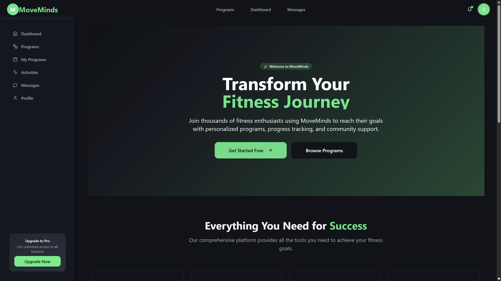

# 🏋️ MoveMinds - Fitness Learning Platform

**MoveMinds** is a comprehensive full-stack fitness learning platform that goes beyond traditional fitness tracking. It's a complete ecosystem where users can learn through tutorials, enroll in instructor-created programs, and engage with a secure, role-based community.

Built with **Spring Boot REST API**, **React 18 + TypeScript + Vite**, and **MySQL**.

## 📋 Table of Contents

- [Project Description](#project-description)
- [Screenshots](#screenshots)
- [Setup Instructions](#setup-instructions)
- [Demo Video](#demo-video)
- [Features](#features)
- [Technologies Used](#technologies-used)
- [Architecture](#architecture)
- [Security Features](#security-features)
- [API Documentation](#api-documentation)
- [Contributing](#contributing)
- [License](#license)

## 📝 Project Description

MoveMinds is not just a fitness tracker - it's a comprehensive learning platform that combines fitness tracking with educational content. The platform serves three distinct user roles:

- **Users**: Browse and enroll in fitness programs, track activities, communicate with instructors
- **Instructors**: Create and manage fitness programs, interact with students, monitor progress
- **Admins**: Oversee the entire platform, approve programs, manage users, and view analytics

### Key Features:
- 🎯 **Program Management**: Instructors create programs that require admin approval
- 💳 **Payment Integration**: Secure payment processing with PayHere sandbox
- 💬 **Real-time Messaging**: Direct communication between users and instructors
- 📊 **Analytics Dashboard**: Comprehensive admin analytics and reporting
- 🔐 **Role-based Security**: JWT authentication with Spring Security
- 📱 **Responsive Design**: Works seamlessly across all devices

## 📸 Screenshots

### Homepage

*Modern landing page with hero section, features overview, and testimonials*

### User Dashboard

*User dashboard showing enrolled programs, recent activities, and quick actions*

### Program Browsing

*Program catalog with filtering, search, and enrollment options*

### Instructor Dashboard

*Instructor dashboard with program creation, student management, and analytics*

### Admin Dashboard

*Comprehensive admin panel with user management, program approval, and system analytics*

### Program Creation Form

*Multi-step program creation form with validation and image upload*

### Payment Integration

*Secure payment processing with PayHere integration*

### Messaging System

*Real-time messaging interface between users and instructors*

## 🚀 Setup Instructions

### Prerequisites
- Java 17 or higher
- Node.js 18 or higher
- MySQL 8.0 or higher
- Maven 3.6 or higher
- Git

### Backend Setup

1. **Clone the repository**
   ```bash
   git clone https://github.com/yourusername/moveminds.git
   cd moveminds/backend
   ```

2. **Database Configuration**
   ```bash
   # Create MySQL database
   mysql -u root -p
   CREATE DATABASE moveminds;
   ```

3. **Configure Application Properties**
   ```bash
   # Copy and edit application properties
   cp src/main/resources/application-template.properties src/main/resources/application.properties
   ```
   
   Update the following in `application.properties`:
   ```properties
   spring.datasource.url=jdbc:mysql://localhost:3306/moveminds
   spring.datasource.username=your_username
   spring.datasource.password=your_password
   jwt.secret=your_jwt_secret_key
   payhere.merchant.id=your_payhere_merchant_id
   payhere.merchant.secret=your_payhere_merchant_secret
   ```

4. **Run Database Setup**
   ```bash
   # Execute database setup script
   mysql -u root -p moveminds < setup-mysql.sql
   mysql -u root -p moveminds < seed.sql
   ```

5. **Start the Backend**
   ```bash
   # Using Maven wrapper
   ./mvnw spring-boot:run
   
   # Or using Maven
   mvn spring-boot:run
   ```

   The backend will be available at `http://localhost:8081`

### Frontend Setup

1. **Navigate to Frontend Directory**
   ```bash
   cd ../frontend
   ```

2. **Install Dependencies**
   ```bash
   npm install
   ```

3. **Configure Environment**
   ```bash
   # Create environment file
   cp .env.example .env.local
   ```
   
   Update the following in `.env.local`:
   ```env
   VITE_API_BASE_URL=http://localhost:8081/api
   VITE_APP_NAME=MoveMinds
   ```

4. **Start the Frontend**
   ```bash
   npm run dev
   ```

   The frontend will be available at `http://localhost:5173`

### Default Login Credentials

#### Admin Account
- **Username**: admin@moveminds.com
- **Password**: admin123

#### Instructor Account
- **Username**: instructor@moveminds.com
- **Password**: instructor123

#### User Account
- **Username**: user@moveminds.com
- **Password**: user123

### PayHere Configuration

1. **Register for PayHere Sandbox**
   - Visit [PayHere Sandbox](https://sandbox.payhere.lk/)
   - Create a merchant account
   - Get your Merchant ID and Merchant Secret

2. **Configure PayHere Settings**
   - Update `payhere.merchant.id` and `payhere.merchant.secret` in `application.properties`
   - Set `payhere.sandbox.mode=true` for testing

## 🎥 Demo Video

**YouTube Demo Video**: [MoveMinds - Full Stack Fitness Learning Platform Demo](https://youtu.be/Y8fMXlE5U-A)

*The demo video showcases all key features including program creation workflow, admin approval process, payment integration, and user experience across different roles.*

## ✨ Features

### User Features
- 🔍 **Program Discovery**: Browse and search fitness programs
- 💳 **Secure Enrollment**: Pay and enroll in programs via PayHere
- 📚 **Learning Management**: Access program content and track progress
- 📊 **Activity Tracking**: Log workouts and monitor fitness journey
- 💬 **Instructor Communication**: Direct messaging with instructors
- 👤 **Profile Management**: Update personal information and preferences

### Instructor Features
- 🎯 **Program Creation**: Multi-step form with validation and image upload
- 📈 **Analytics Dashboard**: View program statistics and student progress
- 👥 **Student Management**: Monitor enrolled students and their progress
- 💬 **Student Communication**: Respond to student messages and queries
- 📊 **Performance Tracking**: Track program popularity and completion rates

### Admin Features
- 🛡️ **Program Approval**: Review and approve instructor-created programs
- 👥 **User Management**: View, edit, suspend, or delete user accounts
- 📊 **System Analytics**: Comprehensive dashboard with charts and metrics
- 💰 **Revenue Tracking**: Monitor payment transactions and revenue
- ⚙️ **System Settings**: Configure platform settings and parameters
- 📤 **Data Export**: Export user data and analytics reports

## 🛠️ Technologies Used

### Backend
- **Spring Boot 3.2.2** - Application framework
- **Spring Security** - Authentication and authorization
- **Spring Data JPA** - Database operations
- **MySQL** - Primary database
- **JWT** - Stateless authentication
- **PayHere API** - Payment processing
- **Lombok** - Boilerplate code reduction
- **ModelMapper** - Object mapping
- **Spring Mail** - Email functionality
- **iText** - PDF generation
- **AspectJ** - Cross-cutting concerns

### Frontend
- **React 18** - UI framework
- **TypeScript** - Type safety
- **Vite** - Build tool and dev server
- **Tailwind CSS** - Styling framework
- **Radix UI** - Accessible UI components
- **React Hook Form** - Form management
- **React Query** - Server state management
- **React Router DOM** - Client-side routing
- **Axios** - HTTP client
- **Framer Motion** - Animations
- **Lucide React** - Icons

### Development Tools
- **ESLint** - Code linting
- **Prettier** - Code formatting
- **Git** - Version control
- **Maven** - Build automation
- **npm** - Package management

## 🏗️ Architecture

### Backend Architecture
```
├── Controllers/     # REST API endpoints
├── Services/        # Business logic layer
├── Repositories/    # Data access layer
├── Entities/        # Database models
├── DTOs/           # Data transfer objects
├── Config/         # Configuration classes
└── Utils/          # Utility classes
```

### Frontend Architecture
```
├── components/     # Reusable UI components
├── pages/         # Page components
├── hooks/         # Custom React hooks
├── lib/           # API clients and utilities
├── types/         # TypeScript type definitions
└── styles/        # Global styles and themes
```

## 🔐 Security Features

- **JWT Authentication**: Stateless token-based authentication
- **Role-based Authorization**: Different access levels for Users, Instructors, and Admins
- **Password Encryption**: BCrypt hashing for secure password storage
- **Input Validation**: Server-side validation to prevent malicious input
- **CORS Configuration**: Secure cross-origin resource sharing
- **SQL Injection Prevention**: Parameterized queries and JPA
- **XSS Protection**: Input sanitization and output encoding

## 📚 API Documentation

### Authentication Endpoints
- `POST /api/auth/login` - User login
- `POST /api/auth/register` - User registration
- `POST /api/auth/logout` - User logout

### Program Endpoints
- `GET /api/programs` - Get all programs
- `POST /api/instructor/programs` - Create program (Instructor)
- `PUT /api/admin/programs/{id}/approve` - Approve program (Admin)

### User Endpoints
- `GET /api/users/profile` - Get user profile
- `PUT /api/users/profile` - Update user profile
- `GET /api/admin/users` - Get all users (Admin)

### Payment Endpoints
- `POST /api/payment/create` - Create payment
- `POST /api/payment/complete` - Complete payment

## 🤝 Contributing

1. Fork the repository
2. Create a feature branch (`git checkout -b feature/amazing-feature`)
3. Commit your changes (`git commit -m 'Add some amazing feature'`)
4. Push to the branch (`git push origin feature/amazing-feature`)
5. Open a Pull Request

## 📄 License

This project is licensed under the MIT License - see the [LICENSE](LICENSE) file for details.

## 📞 Contact

- **Project Link**: [https://github.com/shehanGJ/MoveMinds](https://github.com/shehanGJ/MoveMinds)
- **Demo Video**: [MoveMinds - Full Stack Fitness Learning Platform Demo](https://youtu.be/Y8fMXlE5U-A)

---

**MoveMinds** - Transforming fitness through technology and community! 🏋️‍♂️💪