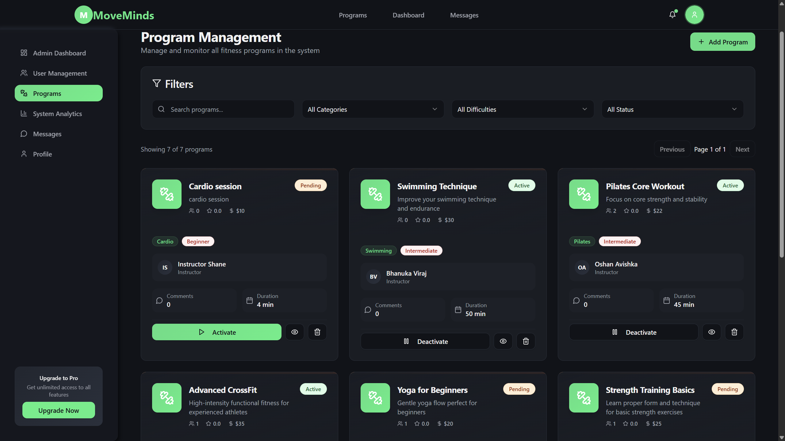
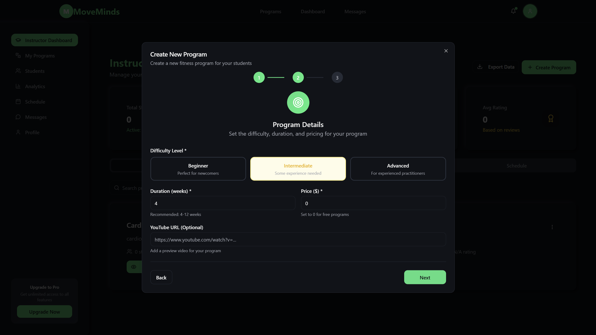

# 🏋️ MoveMinds - Fitness Learning Platform

[](https://www.oracle.com/java/)
[](https://spring.io/projects/spring-boot)
[](https://reactjs.org/)
[](https://www.typescriptlang.org/)
[](https://www.mysql.com/)
[](https://vitejs.dev/)
[](https://tailwindcss.com/)
[](LICENSE)

[](https://youtu.be/Y8fMXlE5U-A)

**MoveMinds** is a comprehensive full-stack fitness learning platform that goes beyond traditional fitness tracking. It's a complete ecosystem where users can learn through tutorials, enroll in instructor-created programs, and engage with a secure, role-based community.

Built with **Spring Boot REST API**, **React 18 + TypeScript + Vite**, and **MySQL**.

## 📋 Table of Contents

- [Project Description](#project-description)
- [Screenshots](#screenshots)
- [Setup Instructions](#setup-instructions)
- [Demo Video](#demo-video)
- [Features](#features)
- [Technologies Used](#technologies-used)
- [Architecture](#architecture)
- [Security Features](#security-features)
- [API Documentation](#api-documentation)
- [Contributing](#contributing)
- [License](#license)

## 📝 Project Description

MoveMinds is not just a fitness tracker - it's a comprehensive learning platform that combines fitness tracking with educational content. The platform serves three distinct user roles:

- **Users**: Browse and enroll in fitness programs, track activities, communicate with instructors
- **Instructors**: Create and manage fitness programs, interact with students, monitor progress
- **Admins**: Oversee the entire platform, approve programs, manage users, and view analytics

### Key Features:
- 🎯 **Program Management**: Instructors create programs that require admin approval
- 💳 **Payment Integration**: Secure payment processing with PayHere sandbox
- 💬 **Real-time Messaging**: Direct communication between users and instructors
- 📊 **Analytics Dashboard**: Comprehensive admin analytics and reporting
- 🔐 **Role-based Security**: JWT authentication with Spring Security
- 📱 **Responsive Design**: Works seamlessly across all devices

## 📸 Screenshots

### Homepage

*Clean and modern landing page with hero section featuring "Get Started Free" and "Browse Programs" buttons, personalized fitness program icons, customer testimonials with profile circles, and footer with sign-in and free trial options. The design uses a green color scheme with professional typography.*

### Admin Dashboard Screenshots

#### Admin Dashboard Overview

*Admin main dashboard showing comprehensive system statistics including total users, instructors, programs, and enrollments. Features quick access cards for user management, program approval, system analytics, and revenue tracking with clean card-based layout.*


#### Admin User Management

*Comprehensive user management interface showing user list with search and filtering capabilities, user details, account status management, and bulk operations for efficient user administration.*

#### Admin Program Approval

*Program approval workflow showing pending instructor-created programs with program details, instructor information, creation date, and approval/rejection buttons. Displays program status and allows admins to review program content before approval.*

### Instructor Dashboard Screenshots

#### Instructor Dashboard Overview

*Instructor main dashboard displaying key metrics including total programs created, enrolled students, total revenue, and program completion rates. Shows recent activities and quick access to program creation and student management.*

#### Program Creation Form

*Multi-step program creation form with comprehensive fields including program name, description, category selection, difficulty level, duration, price, location, and program image upload. Features real-time form validation, dropdown selections for categories and locations, and a clean modal interface for creating new fitness programs.*

#### Program Creation - Difficulty Selection

*Second step of the program creation form focusing on difficulty level selection and additional program details. Features difficulty level options (Beginner, Intermediate, Advanced), program duration settings, pricing configuration, and location selection with dropdown menus for easy selection.*

### User Dashboard Screenshots

#### User Dashboard Overview

*User main dashboard displaying enrolled programs, recent activities, progress tracking, and quick action buttons. Shows program cards with completion status and upcoming sessions.*

#### Program Catalog

*Program browsing interface with filtering options by category, difficulty level, and price range. Displays program cards with instructor information, ratings, and enrollment buttons.*

#### Payment Integration

*PayHere payment gateway integration showing payment form, transaction details, and confirmation page. Features secure payment processing for program enrollments.*

#### My Enrolled Programs

*My enrolled programs interface displaying all programs the user has enrolled in, showing program details, enrollment status, progress tracking, completion percentage, and access to program content. Features program cards with instructor information and quick access to continue learning.*

#### Log Activity Window

*Activity logging interface allowing users to record new workouts, track exercises, set personal goals, and log fitness activities. Features form inputs for activity type, duration, intensity, and notes.*

#### Program Content Learning

*Program content learning page displaying course materials, video tutorials, workout instructions, and progress tracking. Features lesson navigation, completion checkmarks, progress indicators, and interactive learning tools to help users master their enrolled fitness programs.*

#### Log Activity Window

*Activity logging interface allowing users to record new workouts, track exercises, set personal goals, and log fitness activities. Features form inputs for activity type, duration, intensity, and notes.*

#### Messaging System

*Real-time messaging interface for communication between users and instructors. Shows conversation history, message threads, and notification system.*

#### User Profile Management

*User profile management interface allowing users to update personal information, change password, manage preferences, and view account settings. Features profile picture upload and account customization options.*

## 🚀 Setup Instructions

### Prerequisites
- Java 17 or higher
- Node.js 18 or higher
- MySQL 8.0 or higher
- Maven 3.6 or higher
- Git

### Backend Setup

1. **Clone the repository**
   ```bash
   git clone https://github.com/yourusername/moveminds.git
   cd moveminds/backend
   ```

2. **Database Configuration**
   ```bash
   # Create MySQL database
   mysql -u root -p
   CREATE DATABASE moveminds;
   ```

3. **Configure Application Properties**
   ```bash
   # Copy and edit application properties
   cp src/main/resources/application-template.properties src/main/resources/application.properties
   ```
   
   Update the following in `application.properties`:
   ```properties
   spring.datasource.url=jdbc:mysql://localhost:3306/moveminds
   spring.datasource.username=your_username
   spring.datasource.password=your_password
   jwt.secret=your_jwt_secret_key
   payhere.merchant.id=your_payhere_merchant_id
   payhere.merchant.secret=your_payhere_merchant_secret
   ```

4. **Run Database Setup**
   ```bash
   # Execute database setup script
   mysql -u root -p moveminds < setup-mysql.sql
   mysql -u root -p moveminds < seed.sql
   ```

5. **Start the Backend**
   ```bash
   # Using Maven wrapper
   ./mvnw spring-boot:run
   
   # Or using Maven
   mvn spring-boot:run
   ```

   The backend will be available at `http://localhost:8081`

### Frontend Setup

1. **Navigate to Frontend Directory**
   ```bash
   cd ../frontend
   ```

2. **Install Dependencies**
   ```bash
   npm install
   ```

3. **Configure Environment**
   ```bash
   # Create environment file
   cp .env.example .env.local
   ```
   
   Update the following in `.env.local`:
   ```env
   VITE_API_BASE_URL=http://localhost:8081/api
   VITE_APP_NAME=MoveMinds
   ```

4. **Start the Frontend**
   ```bash
   npm run dev
   ```

   The frontend will be available at `http://localhost:5173`


### PayHere Configuration

1. **Register for PayHere Sandbox**
   - Visit [PayHere Sandbox](https://sandbox.payhere.lk/)
   - Create a merchant account
   - Get your Merchant ID and Merchant Secret

2. **Configure PayHere Settings**
   - Update `payhere.merchant.id` and `payhere.merchant.secret` in `application.properties`
   - Set `payhere.sandbox.mode=true` for testing

## 🎥 Demo Video

**YouTube Demo Video**: [MoveMinds - Full Stack Fitness Learning Platform Demo](https://youtu.be/Y8fMXlE5U-A)

*The demo video showcases all key features including program creation workflow, admin approval process, payment integration, and user experience across different roles.*

## ✨ Features

### User Features
- 🔍 **Program Discovery**: Browse and search fitness programs
- 💳 **Secure Enrollment**: Pay and enroll in programs via PayHere
- 📚 **Learning Management**: Access program content and track progress
- 📊 **Activity Tracking**: Log workouts and monitor fitness journey
- 💬 **Instructor Communication**: Direct messaging with instructors
- 👤 **Profile Management**: Update personal information and preferences

### Instructor Features
- 🎯 **Program Creation**: Multi-step form with validation and image upload
- 📈 **Analytics Dashboard**: View program statistics and student progress
- 👥 **Student Management**: Monitor enrolled students and their progress
- 💬 **Student Communication**: Respond to student messages and queries
- 📊 **Performance Tracking**: Track program popularity and completion rates

### Admin Features
- 🛡️ **Program Approval**: Review and approve instructor-created programs
- 👥 **User Management**: View, edit, suspend, or delete user accounts
- 📊 **System Analytics**: Comprehensive dashboard with charts and metrics
- 💰 **Revenue Tracking**: Monitor payment transactions and revenue
- ⚙️ **System Settings**: Configure platform settings and parameters
- 📤 **Data Export**: Export user data and analytics reports

## 🛠️ Technologies Used

### Backend
- **Spring Boot 3.2.2** - Application framework
- **Spring Security** - Authentication and authorization
- **Spring Data JPA** - Database operations
- **MySQL** - Primary database
- **JWT** - Stateless authentication
- **PayHere API** - Payment processing
- **Lombok** - Boilerplate code reduction
- **ModelMapper** - Object mapping
- **Spring Mail** - Email functionality
- **iText** - PDF generation
- **AspectJ** - Cross-cutting concerns

### Frontend
- **React 18** - UI framework
- **TypeScript** - Type safety
- **Vite** - Build tool and dev server
- **Tailwind CSS** - Styling framework
- **Radix UI** - Accessible UI components
- **React Hook Form** - Form management
- **React Query** - Server state management
- **React Router DOM** - Client-side routing
- **Axios** - HTTP client
- **Framer Motion** - Animations
- **Lucide React** - Icons

### Development Tools
- **ESLint** - Code linting
- **Prettier** - Code formatting
- **Git** - Version control
- **Maven** - Build automation
- **npm** - Package management

## 🏗️ Architecture

### Backend Architecture
```
├── Controllers/     # REST API endpoints
├── Services/        # Business logic layer
├── Repositories/    # Data access layer
├── Entities/        # Database models
├── DTOs/           # Data transfer objects
├── Config/         # Configuration classes
└── Utils/          # Utility classes
```

### Frontend Architecture
```
├── components/     # Reusable UI components
├── pages/         # Page components
├── hooks/         # Custom React hooks
├── lib/           # API clients and utilities
├── types/         # TypeScript type definitions
└── styles/        # Global styles and themes
```

## 🔐 Security Features

- **JWT Authentication**: Stateless token-based authentication
- **Role-based Authorization**: Different access levels for Users, Instructors, and Admins
- **Password Encryption**: BCrypt hashing for secure password storage
- **Input Validation**: Server-side validation to prevent malicious input
- **CORS Configuration**: Secure cross-origin resource sharing
- **SQL Injection Prevention**: Parameterized queries and JPA
- **XSS Protection**: Input sanitization and output encoding

## 📚 API Documentation

### Authentication Endpoints
- `POST /api/auth/login` - User login
- `POST /api/auth/register` - User registration
- `POST /api/auth/logout` - User logout

### Program Endpoints
- `GET /api/programs` - Get all programs
- `POST /api/instructor/programs` - Create program (Instructor)
- `PUT /api/admin/programs/{id}/approve` - Approve program (Admin)

### User Endpoints
- `GET /api/users/profile` - Get user profile
- `PUT /api/users/profile` - Update user profile
- `GET /api/admin/users` - Get all users (Admin)

### Payment Endpoints
- `POST /api/payment/create` - Create payment
- `POST /api/payment/complete` - Complete payment

## 🤝 Contributing

1. Fork the repository
2. Create a feature branch (`git checkout -b feature/amazing-feature`)
3. Commit your changes (`git commit -m 'Add some amazing feature'`)
4. Push to the branch (`git push origin feature/amazing-feature`)
5. Open a Pull Request

## 📄 License

This project is licensed under the MIT License - see the [LICENSE](LICENSE) file for details.

## 📞 Contact

- **Project Link**: [https://github.com/shehanGJ/MoveMinds](https://github.com/shehanGJ/MoveMinds)
- **Demo Video**: [MoveMinds - Full Stack Fitness Learning Platform Demo](https://youtu.be/Y8fMXlE5U-A)

---

**MoveMinds** - Transforming fitness through technology and community! 🏋️‍♂️💪